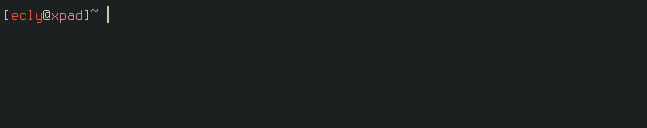

# Typing Test


[](https://github.com/ecly/typing_test/blob/master/LICENSE)
[](https://github.com/psf/black)

Minimal command line game for measuring typing speed with no dependencies.  
Supports both Python2 and Python3.  
Resembles the format from 10fastfingers.  

Supports configurable display format, test duration, word length, vocab and more.  
Use CTRL+R to restart and CTRL+C to exit.  
See `tt --help` for all options.

## Recommended installation
```sh
python3 -m pip install typing_test --user
```

### Manual
```sh
git clone https://github.com/ecly/typing_test
cd typing_test
python3 -m pip install . --user
```

## License
MIT License

Copyright (c) 2019 Emil Lynegaard

Permission is hereby granted, free of charge, to any person obtaining a copy of this software and associated documentation files (the "Software"), to deal in the Software without restriction, including without limitation the rights to use, copy, modify, merge, publish, distribute, sublicense, and/or sell copies of the Software, and to permit persons to whom the Software is furnished to do so, subject to the following conditions:

The above copyright notice and this permission notice shall be included in all copies or substantial portions of the Software.

THE SOFTWARE IS PROVIDED "AS IS", WITHOUT WARRANTY OF ANY KIND, EXPRESS OR IMPLIED, INCLUDING BUT NOT LIMITED TO THE WARRANTIES OF MERCHANTABILITY, FITNESS FOR A PARTICULAR PURPOSE AND NONINFRINGEMENT. IN NO EVENT SHALL THE AUTHORS OR COPYRIGHT HOLDERS BE LIABLE FOR ANY CLAIM, DAMAGES OR OTHER LIABILITY, WHETHER IN AN ACTION OF CONTRACT, TORT OR OTHERWISE, ARISING FROM, OUT OF OR IN CONNECTION WITH THE SOFTWARE OR THE USE OR OTHER DEALINGS IN THE SOFTWARE.
